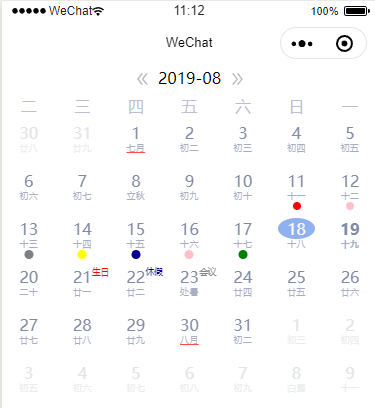
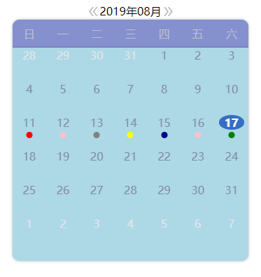
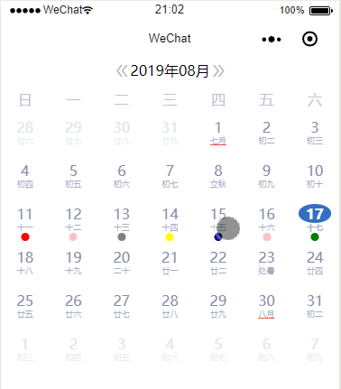
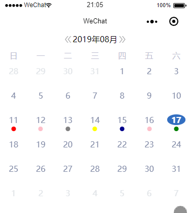
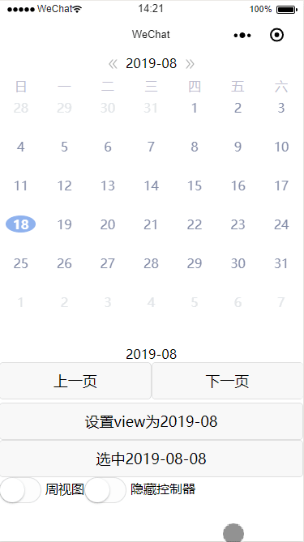
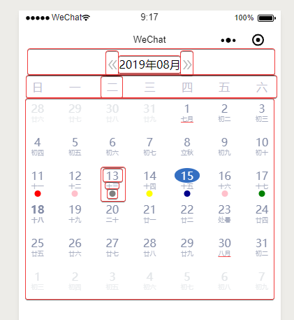

# taro-calendar-customizable

[](https://www.npmjs.com/package/taro-calendar-customizable)
[](https://david-dm.org/zkytech/taro-calendar-customizable)
[](https://opensource.org/licenses/mit-license.php)

可定制标记样式的 `taro` 日历组件。本组件的初期设计完全参考`taro-ui`中的`calendar`组件。在其之上进行了功能扩充和优化。

> ## 特性

- 可定制样式
- 支持农历显示
- 支持周视图
- 可完全自定义控制器

> ## 安装

`yarn add taro-calendar-customizable`

`npm install taro-calendar-customizable`

> ## 使用

```typescript jsx
import Taro, { FunctionComponent } from '@tarojs/taro';
import Calendar from 'taro-calendar-customizable';

const Index: FunctionComponent = () => {
  return (
    <Calendar
      marks={[
        { value: '2019-08-11', color: 'red', markSize: '9px' },
        { value: '2019-08-12', color: 'pink', markSize: '9px' },
        { value: '2019-08-13', color: 'gray', markSize: '9px' },
        { value: '2019-08-14', color: 'yellow', markSize: '9px' },
        { value: '2019-08-15', color: 'darkblue', markSize: '9px' },
        { value: '2019-08-16', color: 'pink', markSize: '9px' },
        { value: '2019-08-17', color: 'green', markSize: '9px' }
      ]}
      mode="lunar"
      selectedDateColor="#346fc2"
      onDayClick={item => console.log(item)}
      onDayLongPress={item => console.log(item)}
    />
  );
};

export default Index;
```

> ### 样式定制

这里展示了最简单的样式设置方式，具体到日期单元格样式的定制可以使用[customStyleGenerator](#样式定制参数)

```typescript jsx
import Taro, { FunctionComponent } from '@tarojs/taro';
import Calendar from 'taro-calendar-customizable';

const Index: FunctionComponent = () => {
  return (
    <Calendar
      marks={[
        { value: '2019-08-11', color: 'red', markSize: '9px' },
        { value: '2019-08-12', color: 'pink', markSize: '9px' },
        { value: '2019-08-13', color: 'gray', markSize: '9px' },
        { value: '2019-08-14', color: 'yellow', markSize: '9px' },
        { value: '2019-08-15', color: 'darkblue', markSize: '9px' },
        { value: '2019-08-16', color: 'pink', markSize: '9px' },
        { value: '2019-08-17', color: 'green', markSize: '9px' }
      ]}
      mode="normal"
      isMultiSelect
      selectedDateColor="#346fc2"
      onDayClick={item => console.log(item)}
      onDayLongPress={item => console.log(item)}
      headStyle={{
        backgroundColor: 'RGBA(12,36,157,0.5)',
        borderTopLeftRadius: '10px',
        borderTopRightRadius: '10px',
        boxShadow: '0 0 5px RGBA(0,0,0,0.3)',
        width: '90vw',
        marginLeft: '5vw',
        zIndex: 2
      }}
      bodyStyle={{
        backgroundColor: 'lightblue',
        borderBottomLeftRadius: '10px',
        borderBottomRightRadius: '10px',
        boxShadow: '0 0 5px RGBA(0,0,0,0.3)',
        borderTop: 'none',
        width: '90vw',
        marginLeft: '5vw'
      }}
    />
  );
};

export default Index;
```

> ### 自定义控制器

```typescript JSX
import Taro, { FunctionComponent, useState } from '@tarojs/taro';
import Calendar from 'taro-calendar-customizable';
import { View, Button, Text, Switch } from '@tarojs/components';

const Index: FunctionComponent = () => {
  const [calendarObj, setCalendarObj] = useState<Calendar>();
  const [currentView, setCurrentView] = useState('2019-08-18');
  const [selected, setSelected] = useState('2019-08-18');
  const [isWeekView, setIsWeekView] = useState(false);
  const [hideController, setHideController] = useState(false);
  return (
    <View>
      <Calendar
        view={isWeekView ? 'week' : 'month'}
        bindRef={ref => {
          setCalendarObj(ref);
        }}
        hideController={hideController}
        currentView={currentView}
        onCurrentViewChange={setCurrentView}
        selectedDate={selected}
        onDayClick={item => setSelected(item.value)}
      />
      <Text style={{ display: 'block', width: '100vw', textAlign: 'center' }}>
        {currentView.slice(0, 7)}
      </Text>
      <Button
        onClick={() => {
          calendarObj ? calendarObj.goPre() : '';
        }}
        style={{ width: '50%', display: 'inline-block' }}
      >
        上一页
      </Button>
      <Button
        onClick={() => {
          calendarObj ? calendarObj.goNext() : '';
        }}
        style={{ width: '50%', display: 'inline-block' }}
      >
        下一页
      </Button>
      <Button onClick={() => setCurrentView('2019-08')}>
        设置view为2019-08
      </Button>
      <Button onClick={() => setSelected('2019-08-08')}>选中2019-08-08</Button>
      <Switch
        checked={isWeekView}
        onChange={e => {
          // @ts-ignore
          setIsWeekView(e.target.value);
        }}
      >
        周视图
      </Switch>
      <Switch
        checked={hideController}
        onChange={e => {
          // @ts-ignore
          setHideController(e.target.value);
        }}
      >
        隐藏控制器
      </Switch>
    </View>
  );
};

export default Index;
```







> ## 参数说明

| 参数           | 说明                                                                       | 类型                                                 | 默认值           |
| -------------- | -------------------------------------------------------------------------- | ---------------------------------------------------- | ---------------- |
| mode           | 显示模式，普通或农历                                                       | `"normal"`&#124;`"lunar"`                            | `"normal"`       |
| view           | 视图模式                                                                   | `"week"`&#124;`"month"`                              | `"month"`        |
| selectedDate   | 当前选中的时间，格式：`YYYY-MM-DD`                                         | `string`                                             | `Date.now()`     |
| currentView    | 当前视图显示的月份`YYYY-MM`                                                | `string`                                             | 当前系统时间年月 |
| minDate        | 最小的可选时间，格式：`YYYY-MM-DD`                                         | `string`                                             | `1970-01-01`     |
| maxDate        | 最大的可选时间，格式：`YYYY-MM-DD`                                         | `string`                                             | `null`           |
| isSwiper       | 是否可以滑动                                                               | `boolean`                                            | `true`           |
| isVertical     | 是否垂直滑动                                                               | `boolean`                                            | `false`          |
| isMultiSelect  | 是否范围选择                                                               | `boolean`                                            | `false`          |
| marks          | 需要标记的时间                                                             | `Array<{value:string,color:string,markSize:string}>` | `[]`             |
| hideArrow      | 是否隐藏箭头                                                               | `boolean`                                            | `false`          |
| hideController | 是否显示控制器                                                             | `false`                                              | `boolean`        |
| showDivider    | 是否显示分割线                                                             | `boolean`                                            | `false`          |
| bindRef        | 父组件通过 ref 可以调用内部方法，主要用于实现[自定义控制器](#自定义控制器) | `(ref:Calendar)=>any`                                | -                |

> ## 事件说明

| 参数                | 说明                                   | 类型                           |
| ------------------- | -------------------------------------- | ------------------------------ |
| onClickPre          | 点击左箭头                             | `() => any`                    |
| onClickNext         | 点击右箭头                             | `() => any`                    |
| onDayClick          | 点击日期时候触发                       | `(item:{value:string}) => any` |
| onDayLongPress      | 长按日期时触发(长按事件与点击事件互斥) | `(item:{value:string}) => any` |
| onCurrentViewChange | 月份/周 改变时触发                     | `(value: string) => any`       |
| onSelectDate        | 选中日期时候触发                       | `(value: SelectDate) => any`   |

> ## 样式定制参数

| 参数                 | 说明                             | 类型                                                                                       |
| -------------------- | -------------------------------- | ------------------------------------------------------------------------------------------ |
| selectedDateColor    | 选中日期的颜色                   | `string`                                                                                   |
| customStyleGenerator | 单元格样式生成器                 | (dateInfo:[StyleGeneratorParams](#StyleGeneratorParams) ) => [CustomStyles](#CustomStyles) |
| pickerTextGenerator  | 日期选择器文本的生成器           | `(currentView:Date)=>string`                                                               |
| headStyle            | head 整体样式                    | `CSSProperties`                                                                            |
| headCellStyle        | head 单元格样式                  | `CSSProperties`                                                                            |
| bodyStyle            | body 整体样式                    | `CSSProperties`                                                                            |
| leftArrowStyle       | 左箭头样式                       | `CSSProperties`                                                                            |
| rightArrowStyle      | 右箭头样式                       | `CSSProperties`                                                                            |
| datePickerStyle      | 日期选择器样式                   | `CSSProperties`                                                                            |
| pickerRowStyle       | 日期选择器&左右箭头 所在容器样式 | `CSSProperties`                                                                            |

进行样式定制时可以参考组件内部结构图：



## 类型说明

> ### StyleGeneratorParams

每个单元格包含的所有信息

| 参数         | 说明                                                                            | 类型                                  |
| ------------ | ------------------------------------------------------------------------------- | ------------------------------------- |
| date         | 当前月的第几天 1 ~ 31                                                           | `number`                              |
| currentMonth | 是否是属于当前显示的月份（比如 7 月 31 日不属于 8 月，但是会显示在 8 月这一页） | `boolean`                             |
| fullDateStr  | 时间 YYYY-MM-DD                                                                 | `string`                              |
| selected     | 是否被选中                                                                      | `boolean`                             |
| marked       | 是否标记                                                                        | `boolean`                             |
| multiSelect  | 多选模式参数                                                                    | [MultiSelectParam](#MultiSelectParam) |
| lunar        | 农历信息（仅在农历模式下生效）                                                  | [LunarInfo](#LunarInfo) 或 `null`     |

> ### CustomStyles

样式生成器返回结果

| 参数           | 说明           | 类型            |
| -------------- | -------------- | --------------- |
| lunarStyle     | 农历样式       | `CSSProperties` |
| dateStyle      | 日期样式       | `CSSProperties` |
| markStyle      | 标记样式       | `CSSProperties` |
| containerStyle | 容器单元格样式 | `CSSProperties` |

> ### MultiSelectParam

多选模式参数

| 参数              | 说明             | 类型      |
| ----------------- | ---------------- | --------- |
| multiSelected     | 是否在选择范围内 | `boolean` |
| multiSelectedStar | 是否是选择起点   | `boolean` |
| multiSelectedEnd  | 是否是选择终点   | `boolean` |

> ### LunarInfo

农历信息

| 参数     | 说明                     | 类型             |
| -------- | ------------------------ | ---------------- |
| Animal   | 生肖                     | `string`         |
| IDayCn   | 中文 农历 日 (例:'初二') | `string`         |
| IMonthCn | 中文 农历 月 (例:'八月') | `string`         |
| Term     | 二十四节气               | `string`或`null` |
| astro    | 星座                     | `string`         |
| cDay     | 公历 日                  | `number`         |
| cMonth   | 公历 月                  | `number`         |
| cYear    | 公历 年                  | `number`         |
| gzDay    | 天干地支纪年 日          | `string`         |
| gzMonth  | 天干地支纪年 月          | `string`         |
| gzYear   | 天干地支纪年 年          | `string`         |
| isLeap   | 是否是闰月               | `boolean`        |
| isTerm   | 是否是节气               | `boolean`        |
| isToDay  | 是否是今天               | `boolean`        |
| lDay     | 农历 日                  | `number`         |
| lMonth   | 农历 月                  | `number`         |
| lYear    | 农历 年                  | `number`         |
| nWeek    | 一周的第几天 1~7         | `number`         |
| ncWeek   | 星期 (例:'星期五)        | `string`         |

> 农历信息的生成使用的是[calendar.js](https://github.com/jjonline/calendar.js)，可直接调用农历信息生成工具

农历生成工具调用

```typescript
import { CalendarTools } from 'taro-calendar-customizable';

const LunarInfo = CalendarTools.solar2lunar('2019-08-17');
```
